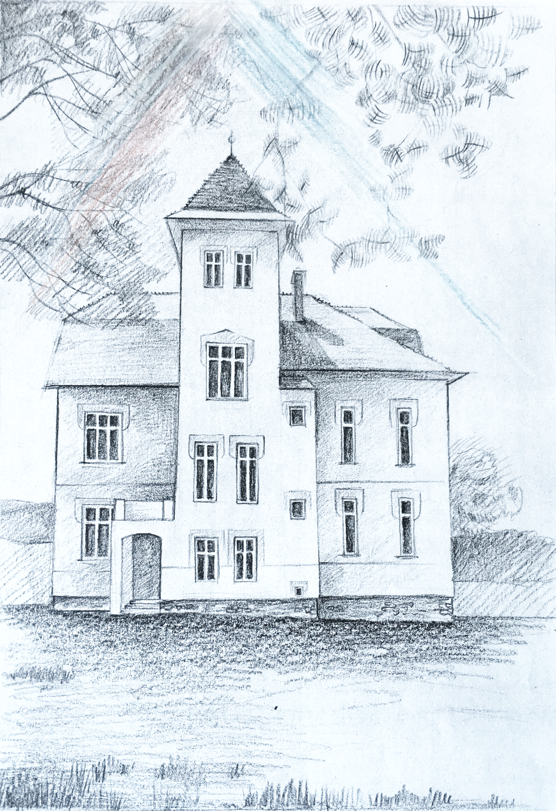

&nbsp;

**Buďte vítáni [v našem domě](/o-dome), který slouží pro bydlení i&nbsp;[společná setkávání](/akce-a-ubytovani). Kéž se Vám u&nbsp;nás spí jako v&nbsp;Boží náruči!**

Rodinný penzion najdete v malebné vesničce na Vysočině ([45&nbsp;minut autem z&nbsp;Brna, 2&nbsp;hodiny z&nbsp;Prahy](/kontakt#cesta-z-brna)). Čeká Vás tu ticho, klid, krásná příroda a&nbsp;zdravý region.

Čím je pro nás [milosrdenství](/o-milosrdenstvi)?

- Časem pro naše vlastní dozrávání, pro pochopení věcí, čas pro chyby, také pro zvolání o pomoc, čas pro nový začátek po zkušenosti.
- Dobrem, které vždy dostáváme jako lidé víc, než si "zasloužíme", než za co "zaplatíme", než které si "naplánujeme", než které si "vynutíme".

Bez této milosti by naše rodina i naše manželství nemohlo existovat :-) 

	Za naši rodinu <a href="/domaci-a-lektori">Jiří a Dana Žižkovští"></a>

