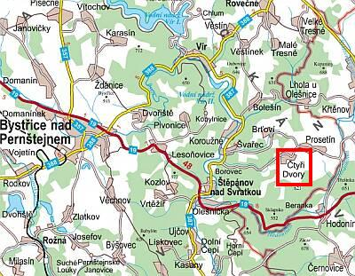

# Kontakt

| **Název provozovny**       | Dům Božího milosrdenství Čtyři Dvory Vysočina |
| **Majitelé**               | [Jiří a Dana Žižkovští](/domaci-a-lektori) |
| **Odpovědná osoba**        | Dana Žižkovská |
| **Datum zahájení provozu** | 1. 5. 2016 |
| **IČ**                     | 70427615 |
| **Číslo účtu**             | 276364075/0300 (VS a SS je přidělen po potvrzení přihlášky) |
| **E-mail**                 | [ctyridvoryvysocina@gmail.com](mailto:ctyridvoryvysocina@gmail.com) |
| **Telefon**                | +420 739 020 886 |

- Dům je v provozu celý rok.
- Najdete nás i na [Facebooku](https://www.facebook.com/DumBozihomilosrdenstvi/?ref=aymt_homepage_panel).

## Lektorské služby

- Pořádání seminářů a kurzů na míru
- Proseniorská tématika s mezigeneračním aspektem
- Aktivizační techniky v práci pro děti / seniory
- Náhradní rodinná péče v praxi

## Cesta z Brna

### Autem

- Nejrychlejší
  - **Brno** - Černá hora – Bořitov – Lysice – Zbraslavice – Kunštát – Rozseč – Louka – Prosetín – **Čtyři Dvory**

- Pohodlná
  - **Brno** - Kuřim – Tišnov – Nedvědice – Štěpánov nad Svratkou – Švařec – **Čtyři Dvory**

### Autobusem

- **Brno, Královo Pole nádraží** – **Olešnice**
  - bez přestupů, pouze 1 hodina
  - z Olešnice dovoz autem až do penzionu

- **Brno, Zvonařka autobusové nádraží** – Bystřici nad Pernštejnem – **Čtyři Dvory**
  - 1 přestup, čas 2 hodiny
  - z Bystřice dovoz autem až do penzionu

### Vlakem

- Do Bystřice nad Pernštejnem
- Do Skalice nad Svitavou
- ze Skalice nebo Bystřice dovoz autem až do penzionu

